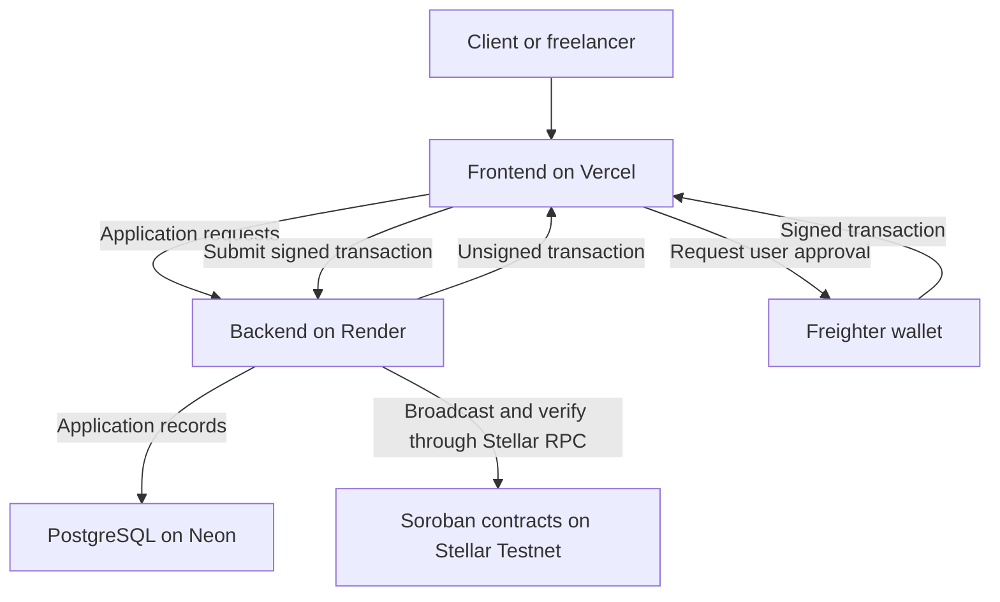

# AccordBridge: Project Overview and Repository Guide

AccordBridge is a Stellar-based application for clients and freelancers to agree on project scope, submit and review deliverables, and manage milestone payments through escrow.

The project is maintained by [AccordBridge Labs](https://github.com/accordbridge-labs) across three related repositories. They share one product roadmap and provide the interface, application services, and smart contracts for the same platform.

**Current stage:** an experimental Stellar Testnet application using valueless ABUSD tokens. It is not an audited or mainnet-ready payment service.

## Repositories

| Repository | Stack | Responsibility |
| --- | --- | --- |
| [accordbridge-frontend](https://github.com/accordbridge-labs/accordbridge-frontend) | Next.js, React, TypeScript | Project workspace, agreements, deliverable reviews, Freighter wallet connection, signing requests, and transaction status. |
| [accordbridge-backend](https://github.com/accordbridge-labs/accordbridge-backend) | NestJS, TypeScript, PostgreSQL | Accounts, access control, agreement history, submissions, reviews, unsigned transaction preparation, and on-chain reconciliation. |
| [accordbridge-contracts](https://github.com/accordbridge-labs/accordbridge-contracts) | Rust, Soroban | Escrow custody, participant authorization, on-chain term acceptance, funding, release, and mutual refunds. |

## How the repositories work together

The frontend communicates with the backend through its API proxy. The backend stores application records and prepares unsigned transactions. Users review and sign through Freighter; their private keys remain in their wallets. The backend submits signed transactions and verifies their outcomes against Stellar.

Smart contracts hold escrow tokens. PostgreSQL stores application records and transaction references, not escrow funds. A successful HTTP request or an accepted agreement alone does not prove that an escrow has been funded.

## Current user workflow

1. **Agree on scope:** A participant creates a project with fixed parties, scope, milestones, delivery criteria, revision limits, and review periods. Both participants accept the same published agreement version.
2. **Connect wallets:** Each participant links a distinct Freighter Testnet wallet by signing an ownership challenge that is never broadcast.
3. **Create escrow:** The client prepares and signs deployment. The frozen agreement commitment binds the participants, token, amount, and terms.
4. **Approve and fund:** Both wallets approve the terms on-chain. The client obtains valueless ABUSD tokens and funds the escrow.
5. **Deliver and review:** The freelancer submits notes and delivery links. The client requests revisions or approves the latest submission.
6. **Settle:** The client separately signs release to the freelancer. Alternatively, both participants can approve a refund to the client.
7. **Confirm:** The backend reconciles the transaction, contract state, and balance before reporting confirmed settlement.

The connected workflow currently supports the first milestone only. Preparing deployment locks that agreement version even if wallet signing is cancelled.

## Application rules and contract rules

The application manages agreement versions, delivery history, revision limits, and work approval. The application's release flow requires approval of the latest submission.

The contract independently enforces participant authorization and fixed settlement destinations. In the current experiment, the client can call the contract directly to release tokens without an off-chain work-approval record. Application review is therefore not a contract-enforced condition.

The contract has no administrator withdrawal authority, dispute resolver, automatic timeout release, split settlement, or wallet recovery mechanism. One refund vote neither moves tokens nor blocks the client's release authority.

ABUSD has no monetary value and is not USDC. Test XLM pays network fees. Testnet resets and storage expiry can invalidate existing deployments and evidence.

## Planned contributor work

Issues are scoped across bug fixes, features, documentation, testing, developer tooling, and contract reliability.

### Frontend

- [Guide users through Freighter Testnet wallet setup](https://github.com/accordbridge-labs/accordbridge-frontend/issues/9).
- [Recover clearly from backend cold starts and unknown transaction outcomes](https://github.com/accordbridge-labs/accordbridge-frontend/issues/10).
- [Add a hosted two-participant wallet and escrow acceptance checklist](https://github.com/accordbridge-labs/accordbridge-frontend/issues/11).

### Backend

- [Update deployment configuration and documentation for Vercel, Render, and Neon Free](https://github.com/accordbridge-labs/accordbridge-backend/issues/7).
- [Add a read-only Stellar Testnet readiness diagnostic](https://github.com/accordbridge-labs/accordbridge-backend/issues/8).
- [Implement bounded reconciliation of unresolved testnet intents](https://github.com/accordbridge-labs/accordbridge-backend/issues/9).

### Contracts

- [Add reproducible contract CI and downloadable WASM artifacts](https://github.com/accordbridge-labs/accordbridge-contracts/issues/4).
- [Expand escrow state-machine and adversarial invariant tests](https://github.com/accordbridge-labs/accordbridge-contracts/issues/5).
- [Define and test storage expiry and restoration procedures](https://github.com/accordbridge-labs/accordbridge-contracts/issues/6).

Each linked issue provides a problem statement, scope, and acceptance criteria. Work is intended to fit contributor sprint cycles, with documentation and interface tasks alongside more advanced backend and contract tasks.

## Cross-repository contribution process

Contributors should submit changes to the repository that owns the affected behavior. When work spans repositories, link dependent issues and pull requests, document interface changes, and state the required integration order.

For example, a new backend response may require frontend handling, while a contract change may require updates to transaction preparation, deployment hashes, and reconciliation.

Pull requests should include relevant validation and documentation updates. Distinguish mocked browser tests, local integration tests, real Testnet transactions, and manual Freighter checks. Never commit database credentials, session cookies, private keys, or recovery phrases.

Maintainers review contributions and coordinate dependencies. Applicable licenses and contribution terms remain a maintainer decision to resolve before opening implementation work broadly to outside contributors.

## Demo and further documentation

- [Hosted testnet workspace](https://accordbridge-frontend.vercel.app/).
- [Backend setup and API overview](https://github.com/accordbridge-labs/accordbridge-backend/blob/main/README.md).
- [Testnet integration and authority limits](https://github.com/accordbridge-labs/accordbridge-backend/blob/main/docs/TESTNET.md).
- [Frontend setup and user flows](https://github.com/accordbridge-labs/accordbridge-frontend/blob/main/README.md).
- [Contract build instructions and limitations](https://github.com/accordbridge-labs/accordbridge-contracts/blob/main/README.md).

The hosted workspace is a testnet demo. Free-service cold starts can delay responses, and existing local test evidence does not establish that every hosted wallet flow has been manually verified.
